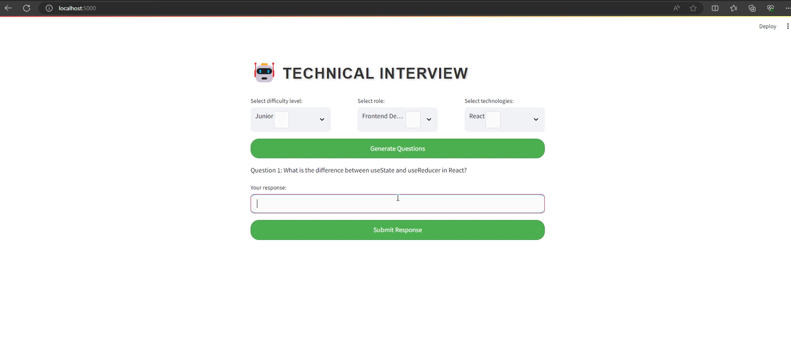
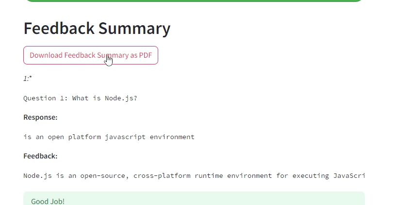

# Technical Interview with TensorRT-LLM RTX Mixtral

This project demonstrates the optimization and execution of language models using TensorRT-LLM on NVIDIA GPUs. It focuses on leveraging the capabilities of TensorRT to enhance performance in tasks involving large language models like LLaMA or Mixtral, with a particular emphasis on models of 7b size or greater.

Conduct your own professional interviews for various development and programming positions, receive feedback, and get a rating based on your responses, and find out if you're ready for a real interview!! All using AI, with the Mixtral model from your local computer!


## Results Visualization

This section showcases the dynamic capabilities of our system to visualize the outputs generated from the model. Through these examples, users can gain insights into how the system not only generates questions based on selected parameters but also provides valuable feedback based on user responses, enhancing the learning and interaction experience.

### Generating Questions with Selected Parameters



This screenshot illustrates the system's interface in action, where users can specify their parameters to generate targeted questions. It highlights the system's adaptability and user-centric design in facilitating personalized interactions.

### Receiving Tailored Feedback



Following the interaction, the system provides users with personalized feedback based on their responses. This feature underscores the system's capacity to support learning and improvement through direct and actionable insights.


## Hardware Requirements

The following hardware specifications are the minimum required to run this repository, although higher specifications are also compatible and may yield better performance:

- **GPU**: NVIDIA RTX 3060 12GB equivalent or higher
- **RAM**: 32 GB
- **Disk Space**: 200 GB

## Software Requirements

To run this project successfully, you will need:

1. **Windows 11**: The operating system compatible with our setup and instructions.
2. **TensorRT-LLM Installation**: Follow the installation guide for TensorRT-LLM from NVIDIA, specifically from the `/rel` branch tailored for Windows. In the test, we used 9.2.0.post12.dev5 version. [TensorRT-LLM Installation Guide](https://github.com/NVIDIA/TensorRT-LLM/tree/rel/windows)
3. **Model Download**: You need to download a model, either LLaMA or Mixtral. In the tests, we used Mixtral-7B as the baseline model before optimization. [Model Base Mixtral 7B](https://huggingface.co/mistralai/Mistral-7B-v0.1)
4. **Model Optimization**: Utilize TensorRT-LLM for model optimization. For detailed steps, refer to this guide: [Model Optimization Guide](https://github.com/NVIDIA/TensorRT-LLM/tree/rel/examples/llama)


## Installation

To set up and run this project, follow these steps:

1. **Clone the Project**: 

We recommend copying it into the "llama" folder of the TensorRT-LLM. If you choose another path, you will need to adjust the paths within the code.[Recommended path for cloning the project.](https://github.com/NVIDIA/TensorRT-LLM/tree/rel/examples/llama)
Navigate to the directory where you want to store the project and clone the repository.

```bash
git clone https://github.com/Jamil-Palma/technical-interview-with-tensorrt-llm-rtx-mixtral.git
cd technical-interview-with-tensorrt-llm-rtx-mixtral
```

2. **Install Dependencies**: Install the necessary Python libraries.

```bash
pip install -r requirements.txt
```

3. **Launch the Application**: Start the Streamlit application on port 5000.

```bash
streamlit run main.py --server.port 5000
```

*Note*: If you choose to store the optimized models and tokenizer in a different location, ensure to adjust the paths in the code and the run files accordingly. [here](https://github.com/Jamil-Palma/technical-interview-with-tensorrt-llm-rtx-mixtral/blob/main/main.py#L23)

## Usage

After installation, the project can be accessed through a web interface provided by Streamlit. Navigate to `http://localhost:5000` in your web browser to interact with the optimized language models.

## Contributing

Contributions to this project are welcome. Please consider the following types of contributions:

- Feature enhancements
- Performance improvements
- Bug fixes

Before contributing, please submit an issue to discuss your ideas or confirm the bug. Pull requests are welcome after issue confirmation.

## Contact

For support or collaboration, please contact us at:

- Jamil Palma - [@JamilPalma](https://twitter.com/JaB_g_g)
- Email - jb.palma.salazar@gmail.com
```
